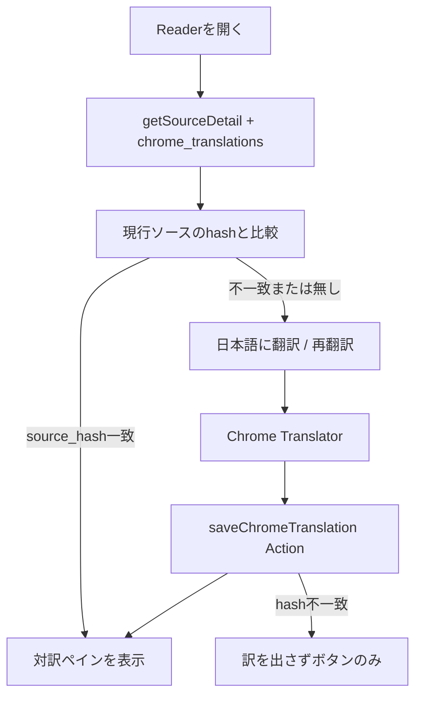

# 設計書：Chrome 翻訳結果の永続化

- 日付: 2026-09-13
- 状態: **採用（T-614 実装）**
- 関連: ADR-006（改訂予定）、`docs/design/2026-09-07-multilingual-chrome-translate.md`、実装設計書 8.5（SC-06 Reader）/ 19 章 / 21.2 章 / 35 章 T-614
- きっかけ: Reader で「日本語に翻訳」を押しても、ページを閉じると対訳が消える。同じ Source を開き直すたびに Desktop Chrome で再翻訳が必要になる

## 1. 背景（実挙動）

T-613 / ADR-006 では、Chrome Translator API で得た対訳は **画面上の一時表示のみ** とし、DB には書かない方針だった。

現状の流れ:

```
Reader 表示
  → getSourceDetail() で原文・記事を読む
  → ChromeTranslate（useState のみ）
  → クリック → Translator.translate(packReaderLinesForTranslate(text))
  → setTranslated(result)   // リロードで消える
```

実害:

- 長文の英語記事・X ネイティブ記事では、翻訳に数十秒かかることがある。一度訳しても Reader を離れると消える。
- Desktop Chrome で訳したあと、モバイルや Translator 非対応環境では **保存済み訳があれば読める** 方がよい（新規翻訳は従来どおり「原文を選択」）。
- 翻訳そのものは引き続き **端末内 Chrome Translator** で行う。サーバー翻訳・AI 予算は使わない。

## 2. 方針（ADR-006 の改訂点）

| 項目 | T-613 / 現 ADR-006 | 本設計（T-614） |
| --- | --- | --- |
| 翻訳の実行 | Chrome Translator（端末内） | **同じ** |
| 翻訳結果の保存 | しない | **専用テーブル `chrome_translations` に保存** |
| 原文カラム | 書き換えない | **同じ**（`x_posts.text`, `articles.content_*` は触らない） |
| AI / メモ列 | 書かない | **同じ**（`user_note`, `ai_*` に書かない） |
| FTS / enrich / 検索 | 入れない | **同じ** |
| 再オープン時 | 毎回ボタンから | **有効な保存があれば対訳ペインを最初から表示** |

**「原文不変」の解釈**: 原文カラムは 1 文字も変えない。Chrome 翻訳は **ユーザーが明示的に押した対訳** なので、`user_note` と同様の **ユーザー操作由来の別カラム（別テーブル）** として扱う。AI が自動生成する要約・分類とは分離する。

## 3. スキーマ

### 3.1 専用テーブル（採用）

`x_posts` / `articles` に列を足す案は、原文テーブルを膨らませ、将来の UPDATE（記事再取得など）と混ざりやすい。**専用テーブル** にする。

```sql
CREATE TABLE chrome_translations (
  id TEXT PRIMARY KEY,
  target_kind TEXT NOT NULL,          -- 'x_post' | 'article'
  target_id TEXT NOT NULL,            -- x_posts.id または articles.id
  target_lang TEXT NOT NULL DEFAULT 'ja',
  source_hash TEXT NOT NULL,          -- 翻訳元 UTF-8 の SHA-256 hex（64 字）
  source_lang TEXT,                   -- Translator pair コード（en, zh, zh-Hant 等）
  text TEXT NOT NULL,                 -- 翻訳結果（最大 24_000 字）
  translated_at TEXT NOT NULL DEFAULT (datetime('now')),
  UNIQUE (target_kind, target_id, target_lang)
);

CREATE INDEX idx_chrome_translations_target
  ON chrome_translations (target_kind, target_id);
```

- マイグレーション: `drizzle/0016_chrome_translations.sql` を追加し、`src/db/sql.ts` の `MIGRATION_FILES` に登録。
- Drizzle: `src/db/schema.ts` に `chromeTranslations` テーブル定義を追加。
- **FTS / `sources_fts` / enrich / 埋め込みには載せない。**
- **`user_id` は足さない**（単一利用者前提は現状どおり）。

### 3.2 保存単位

| `target_kind` | `target_id` | 説明 |
| --- | --- | --- |
| `x_post` | `x_posts.id` | ブックマーク投稿、スレッド各投稿、返信先、返信。投稿ごとに 1 件 |
| `article` | `articles.id` | 記事 1 件につき 1 件（同一 URL の記事は `articles.id` で共有） |

引用投稿: 現行どおり **本文 + 引用を 1 つのソース文字列** として翻訳・保存する（`PostBlock` の `translateSource` と同じ）。

記事: 現行どおり **タイトル + プレーンテキスト本文**（`contentText` または `description`）の先頭 12,000 字。HTML 本文（`contentHtml`）は翻訳入力に使わない（T-613 現行どおり）。

要約（AI 要約）・Inbox / Library カードは対象外。

### 3.3 ソース文字列とハッシュ

表示・Translator 入力・保存の **ハッシュ計算で同じ関数** を使う。`PostBlock` / `ArticleBlock` に散在している連結ロジックを `src/lib/chrome-translate.ts`（または `src/lib/chrome-translate-source.ts`）へ寄せる。

```ts
// 投稿
function postTranslateSource(post: { text: string; quotedSnapshot?: { text?: string } | null }): string {
  const quote = post.quotedSnapshot?.text?.trim() ?? "";
  return quote ? `${post.text}\n\n${quote}` : post.text;
}

// 記事（翻訳入力。HTML は含めない）
function articleTranslateSource(input: {
  title: string | null;
  contentText: string | null;
  description: string | null;
  maxChars?: number; // 既定 12_000
}): string;

// ハッシュ（pack 前のソース文字列）
async function chromeTranslateSourceHash(source: string): Promise<string>; // SHA-256 hex
```

- **`packReaderLinesForTranslate` は Translator 入力専用**。ハッシュは pack **前** のソースに対して取る。
- 読み出し時: DB の `source_hash` と、**現行** ソース文字列の hash を比較。**一致したときだけ** 保存訳を表示する。
- 不一致（記事再取得・投稿編集など）: 古い訳は **表示しない**。DB 行は Phase 1 では残してよい（上書き時に更新）。明示削除 UI は Phase 1 では不要。

## 4. 読み書きフロー



### 4.1 読み込み（Server）

[`getSourceDetail`](src/server/sources/detail.ts) を拡張する。

- ブックマーク投稿・スレッド・返信・返信先の各 `PostCard` に、任意で `chromeTranslation: { text, sourceLang, translatedAt } | null` を付ける。
- 各 `article` に同様のフィールドを付ける。
- 1 クエリでまとめて読む（`target_kind` + `target_id IN (...)`）。全件 SELECT は避け、当該 Source に関係する ID だけに LIMIT する。
- サーバー側でも `source_hash` を再計算し、一致しない行は **null として返す**（クライアントに古い訳を渡さない）。

### 4.2 書き込み（Server Action）

[`saveNote`](src/server/actions/sources.ts) と同じ規約。

```ts
saveChromeTranslation(input: {
  kind: "x_post" | "article";
  id: string;
  text: string;
  sourceLang: string | null;
  sourceHash: string;
}): Promise<ActionResult<{ id: string }>>
```

処理:

1. Zod 検証（`text` 最大 24_000 字、`sourceHash` は 64 字 hex、`id` は ULID 長）。
2. 対象行を DB から読み、ソース文字列を組み立て、**サーバー側で hash を再計算**。
3. クライアントの `sourceHash` と不一致 → `{ ok: false, error: { code: "STALE", ... } }`（409 相当）。画面上の今回の訳はそのまま（保存だけスキップ）。
4. 対象が存在しない → 404。
5. 一致 → `INSERT ... ON CONFLICT DO UPDATE` で upsert（`text`, `source_hash`, `source_lang`, `translated_at` を更新）。
6. **`updateTag("sources")` は呼ばない**（一覧・検索に影響しない）。`refresh()` も任意。
7. **訳文をログに出さない**。

mutate 層: `src/server/sources/chrome-translate.ts`（新規）に upsert / load ヘルパーを置く。

## 5. UI

[`ChromeTranslate`](src/components/ChromeTranslate.tsx) を拡張する。

| props（追加） | 型 | 説明 |
| --- | --- | --- |
| `kind` | `"x_post" \| "article"` | 保存先 |
| `saveId` | `string` | `x_posts.id` または `articles.id` |
| `sourceHash` | `string` | 現行ソースの hash（クライアント計算 or サーバーから渡す） |
| `saved` | `{ text: string; sourceLang: string \| null } \| null` | 有効な保存訳（hash 一致済み） |

挙動:

- マウント時: `saved` があれば `translated` state を初期化し、**対訳ペインを最初から表示**。
- ボタン文言: 未保存 →「日本語に翻訳」、保存済み →「再翻訳」。
- 翻訳成功後: `saveChromeTranslation` を fire-and-forget（失敗しても画面上の訳は表示。STALE 時は toast 等は Phase 1 では出さず、次回リロードで消える）。
- 対訳ペイン: 現行どおり「Chrome 翻訳」ラベル + [`ReaderBody`](src/components/ReaderBody.tsx)（`readable`）。T-220 の段落ルールを適用。
- 「原文を選択」: 変更なし。
- 折りたたみ・削除ボタン: Phase 1 では **やらない**。

[`PostBlock`](src/components/PostBlock.tsx) / [`ArticleBlock`](src/components/ArticleBlock.tsx):

- `translateSource` / `translateText` の組み立てを共通関数に置き換え。
- `getSourceDetail` から渡された `chromeTranslation` と `sourceHash` を `ChromeTranslate` に渡す。

## 6. 技術制約

### 6.1 Chrome Translator（変更なし）

- Desktop Chrome のみでワンクリック翻訳。モバイルは新規翻訳不可（保存済み訳の **閲覧** は可能）。
- 入力上限: 先頭 **12,000 字**（現行 `ArticleBlock` / `ChromeTranslate` と同じ）。
- 保存上限: **24,000 字**（日本語は原文より長くなりうるため 2 倍）。
- 言語 pair / `zh-Hant` マップ: T-613 の `translatorLanguage` / `detectSourceLanguage` をそのまま使う。

### 6.2 容量

- 1 Source あたり最大: 投稿 N 件 + 記事 M 件 × 24,000 字。実用上は数 MB 未満。
- Turso 上でも問題にならない規模。古い stale 行の GC は Phase 2（任意）。

### 6.3 セキュリティ

- ゲート通過後のみ Server Action 可（現行 `proxy.ts`）。
- 訳文はレスポンス・ログ・クライアント error に原文ごと載せない。
- `sourceHash` 不一致で他人の古い hash を送られても、サーバー再計算で弾ける。

### 6.4 やらないこと（Phase 1）

- サーバー翻訳 / DeepL / Gemini（AI 予算・ADR-006 の範囲外）
- 翻訳を FTS・Ask・enrich・埋め込みに入れる
- Library / Inbox に「訳あり」バッジ
- 記事 HTML の対訳保存（プレーンテキスト結果のみ）
- `articles.lang` カラム新設（T-613 Phase 2 のまま）
- 翻訳の自動実行（ボタン操作のみ）
- `user_id` / マルチユーザー

## 7. 代替案と不採用理由

| 案 | 内容 | 不採用理由 |
| --- | --- | --- |
| A. `x_posts` / `articles` に列追加 | `content_text_ja` 等 | 原文テーブルと混ざる。記事再取得 UPDATE と衝突しやすい |
| B. `sources` に列追加 | Source 単位 1 訳 | スレッド複数投稿・複数記事を表現できない |
| C. `localStorage` / IndexedDB のみ | 端末ローカル | 端末を替えると消える。本番 Turso との一貫性がない |
| D. サーバー翻訳 API | 全ブラウザで翻訳 | 送信・料金・キー。ADR-006 方針外 |
| E. AI enrich で翻訳 | Gemini 等 | `budget.guard` 必須。原文カラム・AI 列の扱いと混同 |
| F. FTS に載せる | 訳文も検索 | 意図しない検索ノイズ。原文検索の思想とずれる |

## 8. 実装タスク（T-614）

| 項目 | 内容 |
| --- | --- |
| ID | **T-614** |
| レーン | D（Reader 追随） |
| 依存 | T-613 |
| 主要ファイル | `drizzle/0016_chrome_translations.sql`, `src/db/schema.ts`, `src/lib/chrome-translate.ts`, `src/server/sources/chrome-translate.ts`, `src/server/sources/detail.ts`, `src/server/actions/sources.ts`, `ChromeTranslate.tsx`, `PostBlock.tsx`, `ArticleBlock.tsx` |

### DoD

- [x] 英語記事で「日本語に翻訳」→ リロード → 同じ対訳ペインが最初から出る
- [x] 保存済み時、ボタンが「再翻訳」になる
- [x] 再翻訳成功で DB が上書きされ、リロード後も新しい訳が出る
- [x] 記事本文再取得などで `source_hash` が変わったら、古い訳は **出ない**（ボタンのみ）
- [x] `x_posts.text` / `articles.content_*` / `user_note` / `ai_*` が変わらない（回帰）
- [x] FTS / enrich / 検索 SQL に翻訳列が入っていない
- [x] 日本語本文ではボタンも保存訳も出ない（`shouldOfferTranslate` 現行どおり）
- [x] モバイル: 保存済み訳は表示可。新規翻訳は「原文を選択」のみ
- [x] ADR-006 と実装設計書 8.5 / 19 / 21.2 / 35 章を同 PR で更新

## 9. テスト計画（実装時）

### 単体（必須）

- `postTranslateSource` / `articleTranslateSource` が `PostBlock` / `ArticleBlock` 現行と同じ文字列を返す
- `chromeTranslateSourceHash` の安定性（同じ UTF-8 → 同じ hex）
- upsert: 新規 / 上書き / stale hash 拒否
- `getSourceDetail`: hash 不一致行を null に落とす

### 手動（実装 PR）

- Desktop Chrome: 英語記事 → 翻訳 → リロード → 対訳表示
- 再翻訳 → リロード → 更新確認
- 記事 HTML 再取得後（`source_hash` 変化）→ 古い訳が消える
- 日本語投稿 → ボタンなし
- モバイル Safari: 保存済み訳の閲覧、新規翻訳不可

## 10. 実装設計書・ADR の更新箇所（実装 PR で同時に）

### ADR-006

- 「翻訳結果は DB に書かない」→ **専用テーブル `chrome_translations` に保存する。原文カラム・AI 列・FTS には書かない** に改訂。
- 改訂日を追記。

### 実装設計書

| 章 | 変更 |
| --- | --- |
| **8.5 原文** | Chrome 翻訳成功時に対訳を DB 保存。再オープン時に表示。原文カラムは不変 |
| **19 章 DDL** | `chrome_translations` テーブル定義を追加 |
| **21.2 Server Actions** | `saveChromeTranslation(...)` を列挙に追加 |
| **35 章** | T-614 行を追加。T-613 の DoD「翻訳結果は DB に書かない」は T-614 完了後の状態に合わせて文言更新 |
| **付録F** | 原文カラム不変は維持。「ユーザー操作由来の Chrome 翻訳は `chrome_translations` にのみ書く」を追記 |

### 関連設計書

- `docs/design/2026-09-07-multilingual-chrome-translate.md` §5.5「翻訳結果の永続化 → Phase 2」→ **T-614 で Phase 1 実装** に更新（実装 PR）。

## 11. 受け入れ

既存 A-04（Reader 目視）の延長。

- 英語 / 中国語の Source で、一度翻訳したあと Reader を閉じて開き直しても対訳が残っている。
- 原文ブロックの文字列は保存前後で同一（表示の段落化のみ変わりうる）。
- AI 要約・自分のメモと Chrome 翻訳ペインが視覚的に区別されている（現行 UI を維持）。
